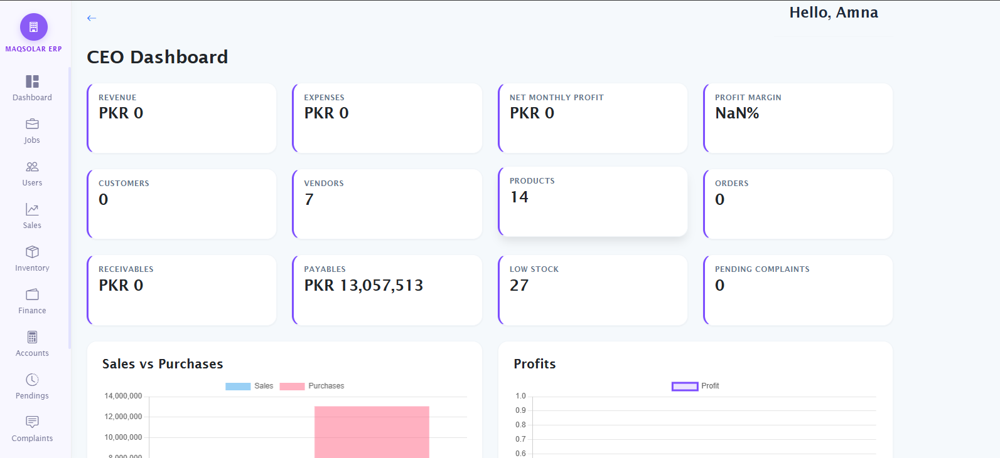
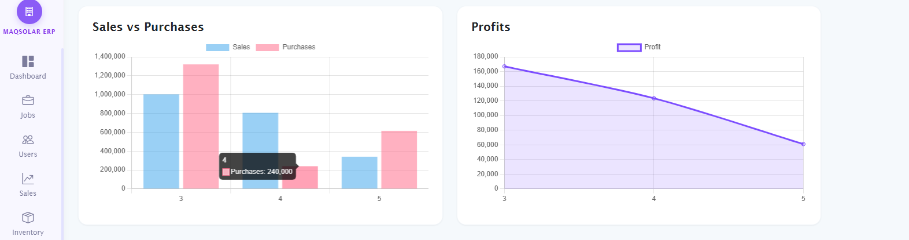
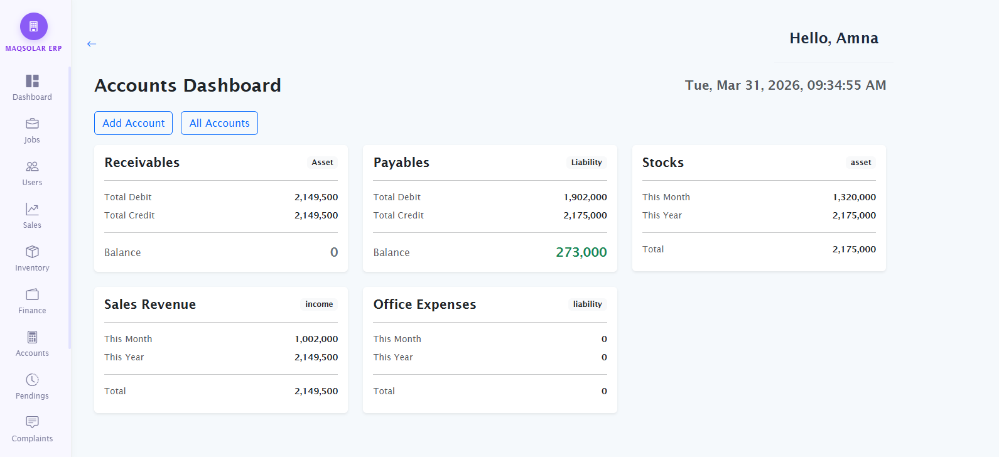
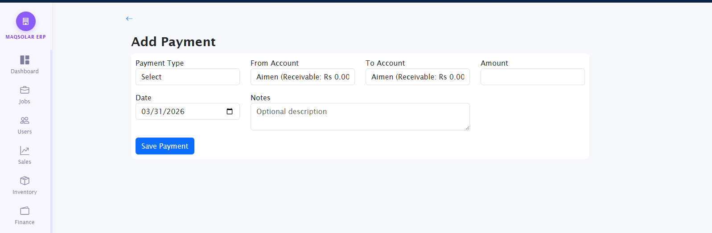
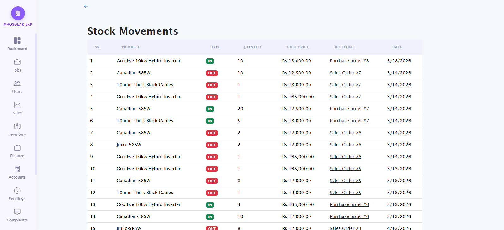

# 🏢 ERP Management System

A modern and scalable **Enterprise Resource Planning (ERP) System** designed to streamline business operations, automate accounting workflows, and provide real-time financial insights.  
This system helps businesses manage **accounts, payments, contracts, customers, and financial transactions** from a centralized dashboard.

---

# 🚀 Key Features

- 📊 Real-time business dashboard
- 📈 Financial charts and analytics
- 💳 Complete accounting management
- 💰 Payment tracking with automatic journal entries
- 📄 Contract management
- 🔐 Secure role-based access control
- ⚡ Fast, reliable, and scalable system

---

# 🖥️ System Screenshots

##  Main Dashboard

Provides an overview of financial activity, recent transactions, and system performance.

---

## Charts & Graph Analytics

Visual representation of financial data to help monitor performance and make informed decisions.

---

## Accounts Management

Manage customer, vendor, and company accounts using standard accounting structures.

---

##  Add Payment Form

Record payments quickly with automated accounting and transaction tracking.

## Stock Movements

Keep track of inventory , from where it comes and where it goes.
---

# ⚙️ Core Modules

- Dashboard
- Accounts Management
- Payments Management
- Customers & Vendors
- Contracts Management
- Financial Reporting
- User Management

---

# 🧠 Smart Accounting Automation

The system automatically:

- Creates customer and vendor accounts
- Generates journal entries
- Updates ledgers
- Records financial transactions

This ensures accurate accounting and reduces manual work.

---

# 🏗️ Technology Stack

**Backend:** Node.js, Express.js, MySQL  
**Frontend:** HTML, CSS, Bootstrap, JavaScript  
**Deployment:** cPanel, Git

---

# 🎯 Suitable For

- Small & Medium Businesses
- Trading Companies
- Service Businesses
- Accounting Firms
- Retail & Distribution Companies

---

# 📞 Contact

For demos, customization, or deployment:

**Email:** your-email@example.com  
**Phone:** +92-XXX-XXXXXXX

